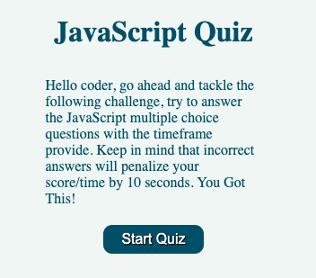
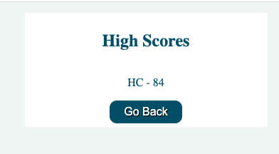

# JavaScript quiz

## Description

A basic multiple choice questions quiz for JavaScript.
This application lists JavaScript questions with 3 possible answers to select from.
The score is timebased, the quicker it takes to solve, the higher the score while incorrect answers deduct 10 points from the score.
The highest scores are saved to local storage.

### URL: https://github.com/hcs847/quiz

